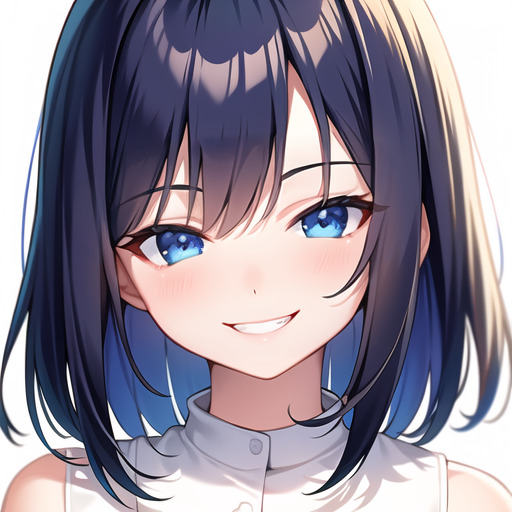
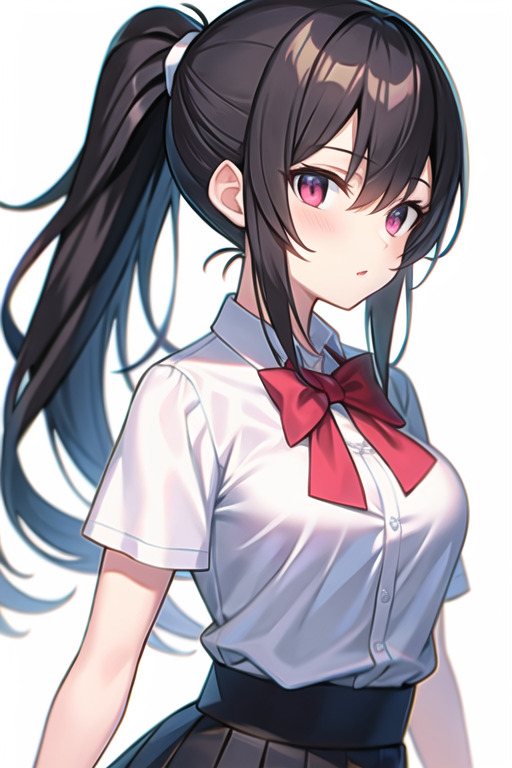
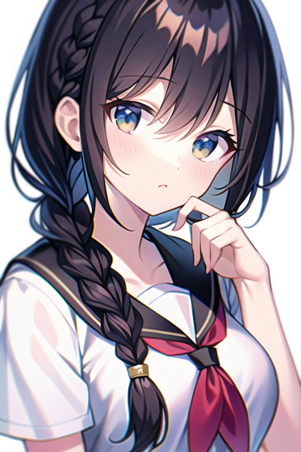
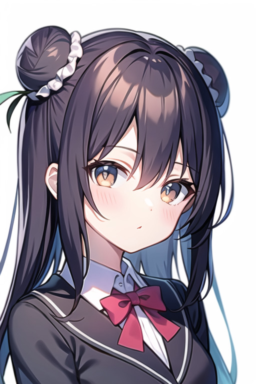
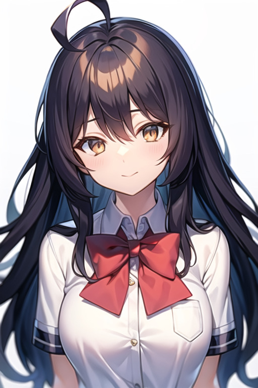
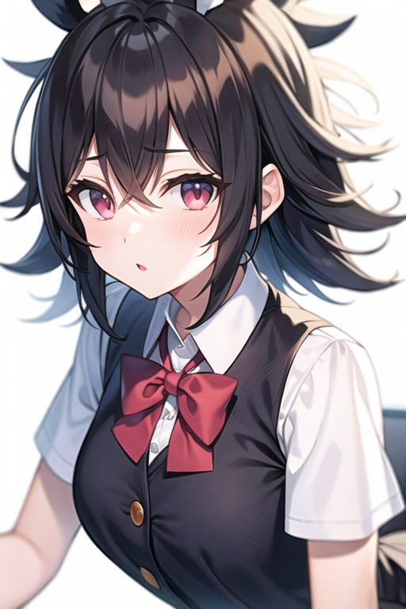
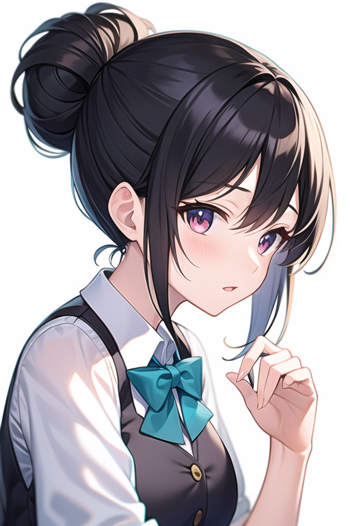

# 目次
- [表情関連](#表情関連)
- [髪の毛関連](#髪型髪色髪の毛関連)

## 表情関連

- 笑顔関連

| プロンプト | 内容 |
|---|---|
| smile | 微笑む |
| grin|にやりと笑う |
| wink | ウインク |
| happy | 幸せそうな顔 |
| chunckle | クスッと笑う |
| laugh | 笑う |
| smug | ドヤ顔 |
| naughty smile | いたずらな笑顔 |
| smirk | にやりとする，見下すような表情 |
| Cracking up | 大爆笑 |
| Let out a laugh | 笑いをこらえない |
| Great Joy | 大喜び |
| Burst out laughing | 爆笑する |
| Big laugh | 大笑い |
| Belly laugh | 腹を抱えて笑う |
| Raise a smile | 微笑ませる |
| Half-smile | 微笑み |

サンプル

| smile | grin | wink |
|---|---|---|
| |  |  |
| | |
| happy | chunckle | laugh |
|  |  |  |
| | |
| smug | naughty smile | smirk |
|  |  |  |
---

    
サンプル画像取得先

    https://e-penguiner.com/emotion-prompt-list-for-image-generation-ai/#index_id6

 

- 怒り、反抗関連

| プロンプト | 内容 |
| --- | --- |
| angry | 怒り |
| scowl | しかめっ面 |
| furious | 激怒 |
| annoyed | イライラした表情 |
| displeased | 不機嫌な表情 |
| sulky | 不機嫌な表情 |
| Grimace | しかめっ面 |
| Glare | にらみつける |
| Sneer | にやり顔 |
| Frown | しかめっ面 |
| wrath | 憤怒 |
| Rage | 激怒 |
| Get angry | 怒る |
| Enraged | 激怒した |
| Snarl | 怒鳴りつける |

サンプル

| angry | scowl | furious |
| --- | --- | --- |
|  |  |  |
| | |
| annoyed | displeased | sulky |
|  |  |  |
|
---

サンプル画像取得先

https://e-penguiner.com/emotion-prompt-list-for-image-generation-ai/

 

- 悲しみ関連

| プロンプト | 内容 |
| --- | --- |
| sad | 悲しみ |
| mournful | 深い悲しみ |
| despairing | 絶望的な |
| cry | 泣いている |
| tearful | cryより強い表現 |
| whimpering | すすり泣く |
| tearful | 涙ぐむ |
| depressed | 落ち込む |
| anguished | 苦しむ |

サンプル

| sad | mournful | despairing |
| --- | --- | --- |
|  |  |  |
| | |
| cry | tearful | whimpering |
|  |  |  |
|
---

サンプル画像取得先

https://e-penguiner.com/emotion-prompt-list-for-image-generation-ai/

 

- 不安関連

| プロンプト | 内容 |
| --- | --- |
| worried | 心配している表情 |
| uneasy | 不安な表情 |
| anguish | 困った表情 |
| nervous | 緊張した表情 |
| stressed | 緊張した表情 |
| tense | 緊張した表情 |
| scared | 怖がった表情 |
| terrified | 怖がった表情 |
| stupefied | うろたえた表情 |

サンプル

| worried | uneasy | anguish |
| --- | --- | --- |
|  |  |  |
| | |
| nervous | stressed | tense |
|  |  |  |
| | |
| scared | terrified | stupefied |
|  |  |  |
|
---

サンプル画像取得先

https://e-penguiner.com/emotion-prompt-list-for-image-generation-ai/

 

- 驚き関連

| プロンプト | 内容 |
| --- | --- |
| surprised | 驚いた表情 |
| shocked | ショックを受けた表情 |
| dumbfounded | 唖然とした表情 |
| stunned | あっけにとられた表情 |
| flabbergasted | 驚愕した表情 |
| astonished | 驚嘆した表情 |

サンプル

| surprised | shocked | dumbfounded |
| --- | --- | --- |
|  |  |  |
| | |
| stunned | flabbergasted | astonished |
|  |  |  |
|
---

サンプル画像取得先

https://e-penguiner.com/emotion-prompt-list-for-image-generation-ai/

 

- 照れ関連

| プロンプト | 内容 |
| --- | --- |
| blush | 赤面した表情 |
| bashful | 恥ずかしがる表情 |
| embarrassed | 恥ずかしがる表情 |
| shy | 内気な表情 |
| nose blush | 鼻のあたりを赤らめる |
| flustered | 慌てた表情 |

サンプル

| blush | bashful | embarrassed |
| --- | --- | --- |
|  |  |  |
| | |
| shy | nose blush | flustered |
|  |  |  |
|
---

サンプル画像取得先

https://e-penguiner.com/emotion-prompt-list-for-image-generation-ai/

 

- その他

| プロンプト | 内容 |
| --- | --- |
| expressionless | 無表情 |
| sleepy | 眠そうな表情 |
| glaring | 睨む |
| tired | 疲れた表情 |
| clenching jaw | 歯を食いしばる |
| squinting | 目を細める |
| fang | 八重歯 |
| hair over one eyes | 片目を髪で隠す |
| heterochromia | オッドアイ |

サンプル

| expressionless | sleepy | glaring |
| --- | --- | --- |
|  |  |  |
| | |
| tired | clenching jaw | squinting |
|  |  |  |
| | |
| fang | hair over one eyes | heterochromia |
|  |  |  |
|
---

サンプル画像取得先

(取得先のURLやモデル)

 

https://note.com/ryon3/n/n5c5c2f79c596からのコピー

| プロンプト | 内容 |
| --- | --- |
| （痛みや嫌悪、不快感で）眉をひそめる | grimace |
| （独善的な）にやにや 片方の口角が上がっている | smirk |
| （不意にロマンチックな状況になって）慌てる顔 | flustered |
| V字眉（ ＼ ／ こういう眉） | v-shaped eyebrows |
| アヘ顔 | ahegao |
| イライラ | annoyed |
| うつ | depressed |
| キューブリックの凝視 | kubrick stare |
| ショックや絶望などでモノクロになること | color drain |
| シリアス、深刻な表情 | serious |
| すすり泣く | sobbing |
| ため息 | sigh |
| ドヤ顔 | doyagao, self-satisfaction, smugness |
| ナーバス、緊張 | nervous |
| にやにや | grin |
| パニック、慌てる | panicking |
| ふくれっ面 | pout |
| レイプ顔 | rape face |
| レイプ目 | empty eyes |
| 押し殺した笑い、笑いをこらえる | stifled laugh |
| 顔に手を置く。やれやれ顔 | facepalm |
| 顔に置く | hand_on_own_face |
| 顔全体の赤面 | full-face blush |
| 泣く | crying |
| 泣く（目を開いて） | crying with eyes open |
| 強制的な笑顔（作り笑い？） | forced smile |
| 恐ろしい | horrified |
| 恐怖、痛み、苦痛で眉をひそめる、ひるむ | wince |
| 驚いた顔 | surprised |
| 軽い笑顔（モナリザのような）ほほえみ | light smile |
| 軽蔑 | disdain |
| 決心した表情、決め顔 | determined |
| 嫌悪 | disgust |
| 口を開ける | open mouth |
| 口角が切り裂かれた笑顔 | glasgow smile |
| 幸せな表情 | happy |
| 考える顔 | thinking |
| 混乱した表情 | confused |
| 罪悪感 | guilt |
| 指で口角を上げる笑顔 | fingersmile |
| 歯を食いしばる | clenched teeth |
| 失望した、呆れ顔 | disappointed |
| 邪悪なにやにや | evil grin |
| 邪悪な笑顔 | evil smile |
| 邪悪な表情、悪だくみ | evil |
| 寂しい、孤独 | lonely |
| 笑顔 | smile |
| 上向きの目（アヘ顔） | rolling eyes |
| 心配する | worried |
| 震える | trembling |
| 酔っ払い、お酒に酔った顔 | drunk |
| 青ざめる | turn pale |
| 絶叫　叫ぶ | screaming |
| 絶頂 | orgasm |
| 絶望 | despair |
| 楕円形の頬 | blush stickers |
| 退屈そうな表情 | bored |
| 恥ずかしい | embarrassed |
| 痛みの表情 | pain |
| 妬みの表情、嫉妬 | envy |
| 怒り | angry |
| 怒りマーク💢、青筋 | anger vein |
| 動揺する | upset |
| 独善的 前で腕を組むようなドヤ顔　お嬢様のような|… | smug |
| 波状の口 | wavy mouth |
| 悲しい | sad |
| 悲しみで眉をひそめる | frown |
| 悲しみの笑顔 | sad smile |
| 疲れた表情 | tired |
| 眉間にしわ | furrowed brow |
| 鼻の上を赤らめる | nose blush |
| 鼻血を流す | nosebleed |
| 病んだ笑顔 | crazy smile |
| 病んでいる表情 | crazy |
| 不満な表情 欲求不満 | frustrated |
| 怖がる | scared |
| 物思いに耽る | pensive |
| 片眉を上げた表情 | raised eyebrow |
| 片目を閉じる（ウインク） | one eye closed (winking) |
| 頬に当てる | hand_on_own_cheek |
| 頬染め | blush |
| 漫画的なびっくり表現 | ^^^ |
| 魅惑的な笑顔 | seductive smile |
| 眠い表情 | sleepy |
| 無表情、真顔 | expressionless |
| 目を閉じた顔 | closed eyes |
| 憂鬱な表情 | gloom (expression) |
| 離れた唇 | parted lips |
| 涙をながす | tears |
| 涙目 | water eye |
| 嘲る顔？　嘲笑？ | troll face |
| 拗ねた顔 | sulking |
| 羞恥A | shy |

 
 

## 髪型、髪色、髪の毛関連

- 髪型関連

| プロンプト | 内容 |
| --- | --- |
| straight hair | ストレート |
| ponytail | ポニーテール |
| twintails | ツインテール |
| braid | 三つ編み |
| bun | お団子 |
| low twintails | おさげ |
| half updo | ハーフアップ |
| ahoge | アホ毛 |
| bedhead | 寝ぐせ |
| blunt bangs | 前髪ぱっつん |
| slicked back hair | オールバック（前髪上げ） |
| wavy hair | ウェーブ |
| shaggy cut | シャギーカット |
| drill hair | 縦ロール |
| floating hair | 風などで舞っている風な髪 |
| bob cut | ボブ |
| chignon | シニヨン |
| bob cut | ボブ |
| chignon | シニヨン |
| bob | ボブカット |
| bob with bangs | 前髪付きボブ |
| low ponytail | ローポニーテール |
| high ponytail | ハイポニーテール |
| curly hair | カール |
| wavy hair | ウェーブのかかった髪 |
| flipped hair | 巻き髪 |
| messy hair | ボサボサの髪 |
| hime cut | 姫カット |
| double bun | お団子×2個 |
| shag | シャギーカット |
| bowl cut hair | おかっぱ |
| lob | ロブカット |
| topknot | トップノット |
| updo | アップドゥ |
| afro | アフロヘアー |
| cornrows | コーンロウ |
| dreadlocks | ドレッドロックス |
| fishtail | フィッシュテール |
| twist out | ツイストアウト |
| finger waves | フィンガーウェーブ |
| mermaid waves | マーメイドウェーブ |
| ballerina bun | バレリーナバン |
| victory rolls | ビクトリーロール |
| afro puffs | アフロパフ |
| box braids | ボックスブレード |
| crochet braids | クロシェブレイド |
| goddess braids | ゴッデスブレイド |
| herringbone braids | ヘリンボーンブレード |
| waterfall braids | ウォーターフォールブレイド |
| Dutch braids | ダッチブレイド |
| French braids | フレンチブレイド |
| halo braids | ヘイローブレイド |
| milkmaid braids | ミルクメイドブレード |
| crown braid | クラウンブレイド |
| messy bun | メッシーバン |
| space buns | スペースバン |
| braid ponytail | 編み込みポニーテール |

サンプル

| straight hair | ponytail | twintails |
| --- | --- | --- |
|  |  |  |
| | |
| braid | bun | low twintails |
|  |  |  |
| | |
| half updo | ahoge | bedhead |
|  |  |  |
| | |
| blunt bangs | slicked back hair | wavy hair |
|  |  |  |
| | |
| shaggy cut | drill hair | floating hair |
|  |  |  |
| | |
| bob cut | chignon |
|  |  |
|
---

サンプル画像取得先

https://e-penguiner.com/hair-prompt-list-for-image-generation-ai/

 

- 髪色

| プロンプト | 内容 |
| --- | --- |
| black hair | 黒髪 |
| brown hair | 茶髪 |
| blonde hair | 金髪 |
| silver hair | 銀髪 |
| pink hair | ピンク髪 |
| red hair | 赤髪 |
| blue hair | 青髪 |
| green hair | 緑髪 |
| yellow hair | 黄髪 |
| gray hair | 灰髪 |
| purple hair | 紫 |
| orange hair | オレンジ |
| bronze hair | ブロンズ |
| white hair | 白 |
| light blue hair | 水色髪 |
| dark blue hair | 濃い目の青髪 |
| black hair, red inner hair | 黒髪インナー赤 |
| black hair, blue inner hair | 黒髪インナー青 |
| black hair, pink inner hair | 黒髪インナーピンク |
| black hair, blonde dip-dye hair | 黒髪先端ブロンズ |
| black hair, silver dip-dye hair | 黒髪先端銀 |
| black hair, pink dip-dye hair | 黒髪先端ピンク |
| black hair, red streaked hair | 黒髪メッシュ赤 |
| black hair, white streaked hair | 黒髪メッシュ白 |
| black hair, pink streaked hair | 黒髪メッシュピンク |
| multicolored hair | ランダムに複数色を混ぜる |

サンプル

| black hair | brown hair | blonde hair |
| --- | --- | --- |
|  |  |  |
| | |
| silver hair | pink hair | red hair |
|  |  |  |
| | |
| blue hair | green hair | yellow hair |
|  |  |  |
| | |
| gray hair | purple hair | orange hair |
|  |  |  |
| | |
| bronze hair | white hair | light blue hair |
|  |  |  |
| | |
| dark blue hair | black hair, red inner hair | black hair, blue inner hair |
|  |  |  |
| | |
| black hair, pink inner hair | black hair, blonde dip-dye hair | black hair, silver dip-dye hair |
|  |  |  |
| | |
| black hair, pink dip-dye hair | black hair, red streaked hair | black hair, white streaked hair |
|  |  |  |
| | |
| black hair, pink streaked hair | multicolored hair | multicolored hair2 |
|  |  |  |
| | |
| multicolored hair3 |
|  |
|
---

サンプル画像取得先

https://e-penguiner.com/hair-prompt-list-for-image-generation-ai/

 

- 長さ

| プロンプト | 内容 |
| --- | --- |
| very long hair | ベリーロング |
| long hair | ロング |
| medium hair | ミディアム |
| short hair | ショート |
| very short hair | ベリーショート |

サンプル

| short hair | long hair | medium hair |
| --- | --- | --- |
|  |  |  |
---

サンプル画像取得先

https://e-penguiner.com/hair-prompt-list-for-image-generation-ai/

 